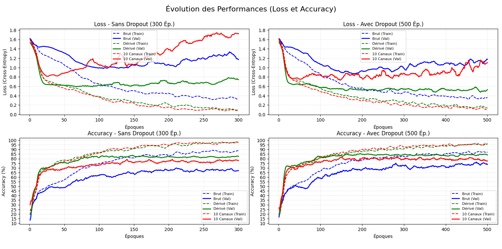
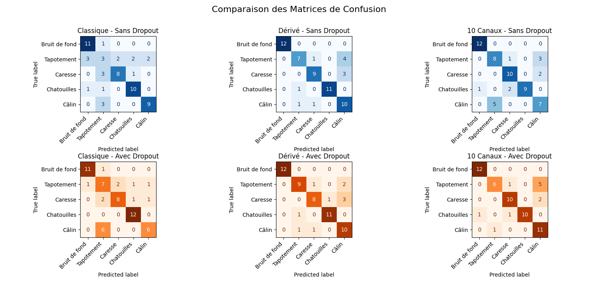

# QT-jacket

⚠️ **Under Development**

[](docs/README_FR.md)


This repository is the continuation of the [QT-Touch](https://github.com/Juste-Leo2/QT-Touch) project.

The goal of **QT-jacket** is to extend the scripts to capture more sensors from a piezo-resistive and piezo-electric jacket.


This architecture is used to classify different types of touches on the robot's jacket. We defined 5 classes for the data acquisition:
- **Class 0 : Nothing / Background noise** (Robot movements, parasite noises).
- **Class 1 : Tap_Attention** (Left or Right Arm) -> Short peaks.
- **Class 2 : Comforting_Caress** (Back or Arm) -> Light, continuous and sliding pressure.
- **Class 3 : Tickles** (Left + Right Torso) -> Fast and irregular pressure variations.
- **Class 4 : Hug / Cuddle** (Global) -> Enveloping, increasing then maintained pressure.

### Data Acquisition and Processing
- **Acquisition**: 1000 points per second (Hz) per sensor. Each acquisition event lasts 5 seconds, resulting in a total of 5000 points per event.
- **Processing**: Decimation to 500 points * 5 sensors.
- **Dataset**: 120 examples per class (equally distributed).
- **CNN Network**: Input dimension `[500, 5]`.


Check out the [tutorial](./docs/tuto.md) to get started with the Raspberry Pi setup and data acquisition.

### Quick Setup (Training & Export)
```bash
uv venv
uv pip install -r requirements.txt
uv run python train/preprocess_data.py

# Training (Best Configuration: Derivative + Dropout)
uv run python train/train.py --derivate --dropout

# Other available options:
# uv run python train/train.py                  # Raw baseline (5 channels)
# uv run python train/train.py --extend         # 10 channels

# Export the trained model to ONNX for the Raspberry Pi
uv run python export_onnx.py --derivate --dropout
```

### Performance & Results
Here is the evolution of the training performances and the resulting confusion matrices:




### Inference
For inference on a Raspberry Pi or any local device, you only need the `inference.py` script and the exported `tactile_deriv_drop_model.onnx` file. The tutorial contains all the necessary details to set this up.

## License

This project is licensed under the **Apache License 2.0**.