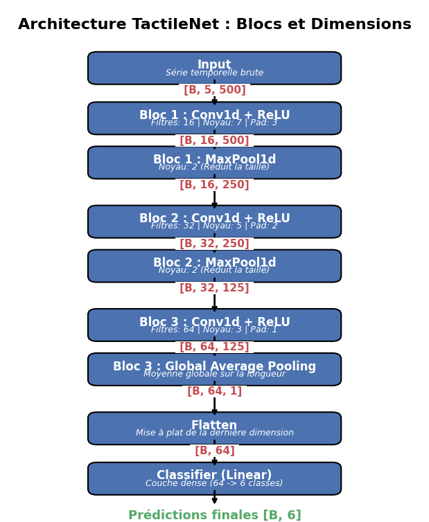

# QT-jacket

⚠️ **En cours de développement**

[](../README.md)


Ce dépôt est la suite du projet [QT-Touch](https://github.com/Juste-Leo2/QT-Touch).

L'objectif de **QT-jacket** est d'étendre les scripts pour intégrer davantage de capteurs issus d'une veste piézo-résistive et piézo-électrique.



Cette architecture est utilisée pour classifier différents types de touchers sur la veste du robot. Nous avons défini 6 classes pour l'acquisition des données :
- **Classe 0 : Rien / Bruit_de_fond** (Mouvements du robot, bruits parasites).
- **Classe 1 : Tapotement_Attention** (Bras Gauche ou Droit) -> Pics courts.
- **Classe 2 : Caresse_Réconfortante** (Dos ou Bras) -> Pression légère, continue et glissante.
- **Classe 3 : Chatouilles** (Torse Gauche + Droit) -> Variations de pression rapides et irrégulières.
- **Classe 4 : Étreinte / Câlin** (Global) -> Pression enveloppante, croissante puis maintenue.
- **Classe 5 : Agrippement_Fort** (Zone isolée) -> Signal saturé.

### Acquisition et traitement des données
- **Acquisition** : 1000 points par seconde (Hz) par capteur. Chaque événement d'acquisition dure 5 secondes, soit un total de 5000 points par événement.
- **Traitement** : Décimation à 100 Hz (500 points * 5 capteurs) et dérivée numérique pour capturer les variations de pression temporelles.
- **Jeu de données** : 120 exemples par classe (répartition équitable).
- **Réseau CNN** : Dimension d'entrée `[500, 5]`.


Découvre le [tutoriel](./tuto.md) pour commencer le setup Raspberry Pi et l'acquisition des données.

### Installation Rapide (Entraînement & Export)
```bash
uv venv
uv pip install -r requirements.txt
uv run python train/preprocess_data.py
uv run python train/train.py
uv run python export_onnx.py
```

### Inférence
Pour l'inférence sur Raspberry Pi ou tout autre appareil, vous n'avez besoin que du script `inference.py` et du fichier exporté `veste_model.onnx`. Le tutoriel contient toutes les informations nécessaires pour exécuter ce script.

## Licence

Ce projet est sous licence **Apache License 2.0**.
