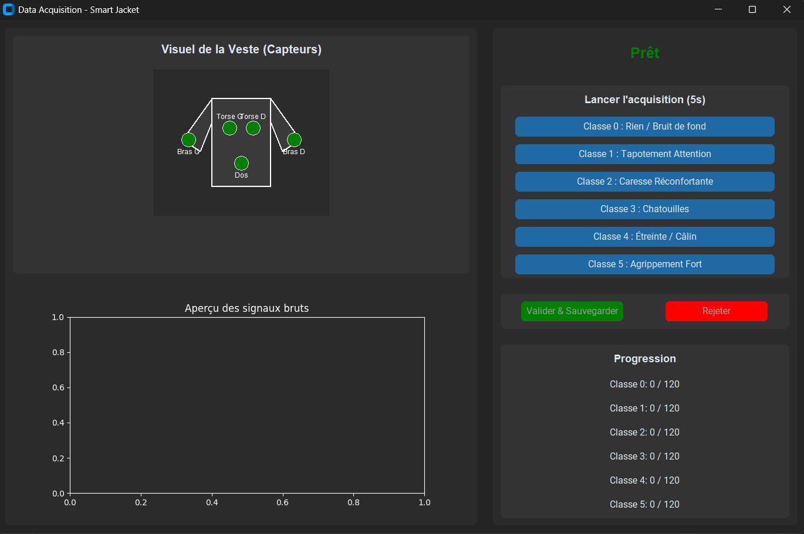

Voici le fichier `tuto.md` mis à jour, intégrant l'avertissement et le lien vers ton autre tutoriel `tuto_display.md` juste avant de lancer l'interface.

---

# Tutoriel : Acquisition de données multi-capteurs (QT-Jacket)

Ce tutoriel explique comment utiliser l'interface graphique pour enregistrer les données de plusieurs capteurs de votre veste vers un format adapté à l'Intelligence Artificielle (Machine Learning).

## 1. Prérequis

Pour que le script fonctionne de manière fluide et rapide, nous avons abandonné `gpiozero` au profit de `spidev`, qui communique directement avec le matériel du Raspberry Pi.

### Activer le port SPI

Si ce n'est pas déjà fait, vous devez activer l'interface SPI de votre Raspberry Pi :

1. Dans le terminal, tapez : `sudo raspi-config`
2. Allez dans `Interfacing Options` -> `SPI` -> Sélectionnez `Yes`.
3. Redémarrez le Raspberry Pi (`sudo reboot`).

### Installer les bibliothèques

Assurez-vous d'avoir les bibliothèques nécessaires. Sur les Raspberry Pi récents, il est recommandé d'utiliser `apt` :

```bash
sudo apt-get update
sudo apt-get install python3-numpy python3-spidev

```

## 2. Câblage du MCP3008 (Très Important !)

Contrairement à l'ancienne méthode, `spidev` **exige** que le MCP3008 soit branché sur les broches SPI officielles du Raspberry Pi.
Voici le câblage à respecter :

* **VDD** et **VREF** se branchent sur **3.3V**
* **AGND** et **DGND** se branchent sur **GND** (Terre)
* **CLK** se branche sur la broche **SCLK** (Pin 23 / GPIO 11)
* **DOUT** se branche sur la broche **MISO** (Pin 21 / GPIO 9)
* **DIN** se branche sur la broche **MOSI** (Pin 19 / GPIO 10)
* **CS / SHDN** se branche sur la broche **CE0** (Pin 24 / GPIO 8)

Vos capteurs (piézoélectriques ou piézorésistifs) se branchent ensuite sur les canaux `CH0`, `CH1`, `CH2`, etc., du MCP3008.

## 3. Lancement et utilisation de l'interface

> **Configuration de l'affichage :** L'outil d'acquisition dispose d'une interface graphique. Si votre Raspberry Pi est utilisé sans écran physique (mode "headless"), vous devez impérativement configurer un retour vidéo sur votre ordinateur. **Veuillez suivre les instructions du fichier [tuto_display](./tuto_display.md) avant de continuer.**

Pour utiliser le script d'acquisition, vous devez préparer un environnement virtuel afin d'isoler les dépendances du projet sans casser le système.

### Préparation de l'environnement

Ouvrez un terminal à la racine de votre projet et créez l'environnement virtuel (l'argument `--system-site-packages` permet de conserver l'accès à `spidev` installé globalement) :

```bash
python3 -m venv .venv --system-site-packages
```

Activez cet environnement :

```bash
source .venv/bin/activate
```

Installez ensuite les dépendances requises pour l'interface :

```bash
pip install -r requirements.txt
```

### Lancement de l'acquisition

Une fois l'environnement activé et les dépendances installées, lancez l'interface graphique avec la commande suivante :

```bash
python data_acquisition/acquisition.py
```

L'interface graphique s'ouvre et vous permet de gérer vos enregistrements de manière visuelle :




1. **Lancer une acquisition :** Cliquez sur l'une des classes (Tapotement, Caresse, Chatouilles, Étreinte, Agrippement) pour démarrer un enregistrement de 5 secondes.
2. **Visualisation :** Observez le retour visuel de la veste (capteurs activés) et l'aperçu du signal brut généré par le geste.
3. **Validation :** Après les 5 secondes, choisissez de valider (et sauvegarder) ou de rejeter l'échantillon si le geste était mal exécuté.
4. **Progression :** Suivez l'avancement de votre collecte de données grâce aux compteurs situés en bas à droite (objectif affiché : 120 échantillons par classe).